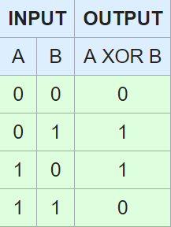

## 136. Single Number
Given a non-empty array of integers, every element appears twice except for one. Find that single one.

### Note:
Your algorithm should have a **linear run time complexity**. Could you implement it **without using extra memory**?

### My solution
``` C++
class Solution {
public:
    int singleNumber(vector<int>& nums) {
        unsigned int result = 0;
        for (int i=0;i<nums.size();i++){
            result = result ^ nums[i];
        }
        return result;
    }
};
```

### Result
```
Runtime: 16 ms, faster than 97.79% of C++ online submissions for Single Number.
Memory Usage: 9.8 MB, less than 43.79% of C++ online submissions for Single Number.
```

### Analysis
Using the XOR to **collect** and **filter** all bits one by one.



## 206. Reverse Linked List
Reverse a singly linked list.
### Example:
```
Input: 1->2->3->4->5->NULL
Output: 5->4->3->2->1->NULL
```
### Follow up:
A linked list can be reversed either **iteratively** or **recursively**. Could you implement both?

### My solution
``` C++
class Solution {
public:
    ListNode* reverseList(ListNode* head) {
        if (head == NULL)
            return head;
        ListNode* mark = NULL,*p= head,*q= head;
        p = head->next;
        q = head;
        q->next=NULL;
        while (p){
            mark=p->next;
            p->next = q;
            q=p;
            p=mark;
        }
        return q;
    }
};
```
### Result
```
Runtime: 8 ms, faster than 100.00% of C++ online submissions for Reverse Linked List.
Memory Usage: 9.2 MB, less than 58.29% of C++ online submissions for Reverse Linked List.
```
### Analysis
Recursive is so hard for me seriously